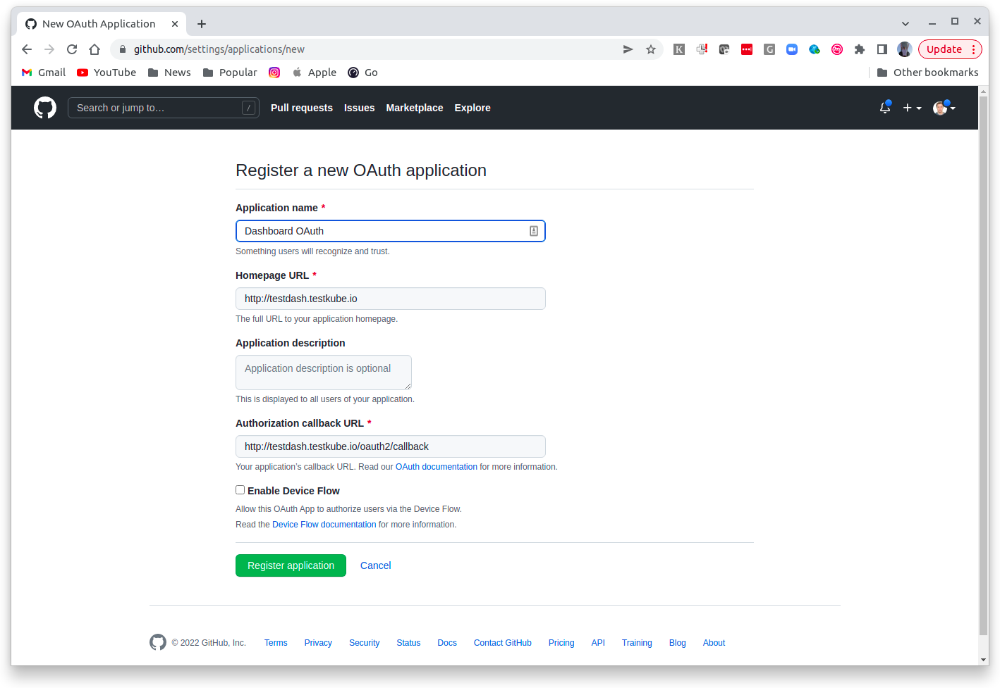
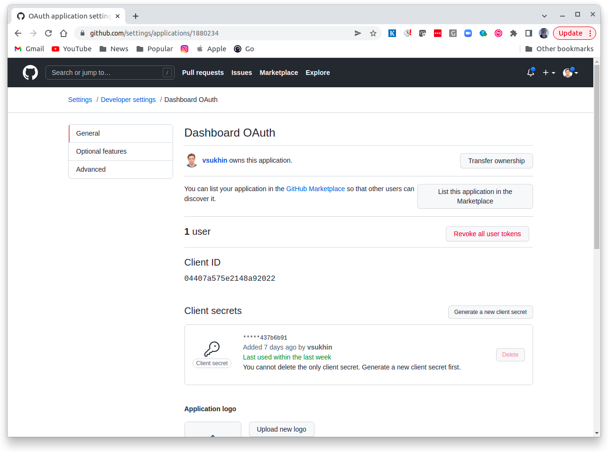

# Testkube UI Authentication

Testkube doesn't provide a separate user/role management system to protect access to its UI.
Users can configure and OAuth based authentication module using Testkube Helm chart parameters.
Testkube can automatically create an OAuth2-Proxy service and deployment integrated
with GitHub, as well as properly configure Kubernetes Nginx Ingress Controller and create required
ingresses.

## **Provide Parameters for UI and API Ingresses**

### **API Ingress**

Pass values to Testkube Helm chart during installation or upgrade (they are empty by default).
Pay attention to the usage of the scheme (http or https) in URIs.

```bash
--set testkube-api.uiIngress.enabled=true \
--set testkube-api.uiIngress.annotations."nginx\.ingress\.kubernetes\.io/auth-url"="http://\$host/oauth2/auth" \
--set testkube-api.uiIngress.annotations."nginx\.ingress\.kubernetes\.io/auth-signin"="http://\$host/oauth2/start?rd=\$escaped_request_uri" \
--set testkube-api.uiIngress.annotations."nginx\.ingress\.kubernetes\.io/access-control-allow-origin"="*"
```

### **UI Ingress**

Pass values to Testkube Helm chart during installation or upgrade (they are empty by default).
Pay attention to the usage of the scheme (http or https) in URIs.

```bash
--set testkube-dashboard.ingress.enabled=true \
--set testkube-dashboard.ingress.annotations."nginx\.ingress\.kubernetes\.io/auth-url"="http://\$host/oauth2/auth" \
--set testkube-dashboard.ingress.annotations."nginx\.ingress\.kubernetes\.io/auth-signin"="http://\$host/oauth2/start?rd=\$escaped_request_uri"
```

## **Create Cookie Secret**

Use OpenSSL to generate a shared secret or it can be any 16 or 32 byte value 64base encoded.

```bash
$ openssl rand -hex 16
48f0a2b815ddc0a437825ccb27548d25
```

## **Create Github OAuth Application**

Register a new Github OAuth application for your personal or organizational account.



Pay attention to the usage of the scheme (http or https) in URIs.
The homepage URL
should be the UI home page http://testdash.testkube.io.

The authorization callback URL
should be a prebuilt page at the UI website http://testdash.testkube.io/oauth2/callback.



Remember the generated Client ID and Client Secret.

## **OAuth Service, Deployment and Ingresses Parameters**

Pass values to the Testkube Helm chart during installation or upgrade (they are empty by default).
Pay attention to the usage of the scheme (http or https) in URIs.

```bash
--set testkube-dashboard.oauth2.enabled=true \
--set testkube-dashboard.oauth2.env.clientId="Client ID from Github OAuth application" \
--set testkube-dashboard.oauth2.env.clientSecret="Client Secret from Github OAuth application" \
--set testkube-dashboard.oauth2.env.githubOrg="Github organization - if you need to provide access only to members of your organization" \
--set testkube-dashboard.oauth2.env.cookieSecret="cookie secret generated above" \
--set testkube-dashboard.oauth2.env.cookieSecure="false - for http connection, true - for https connections" \
--set testkube-dashboard.oauth2.env.redirectUrl="http://demo.testkube.io/oauth2/callback"
```
